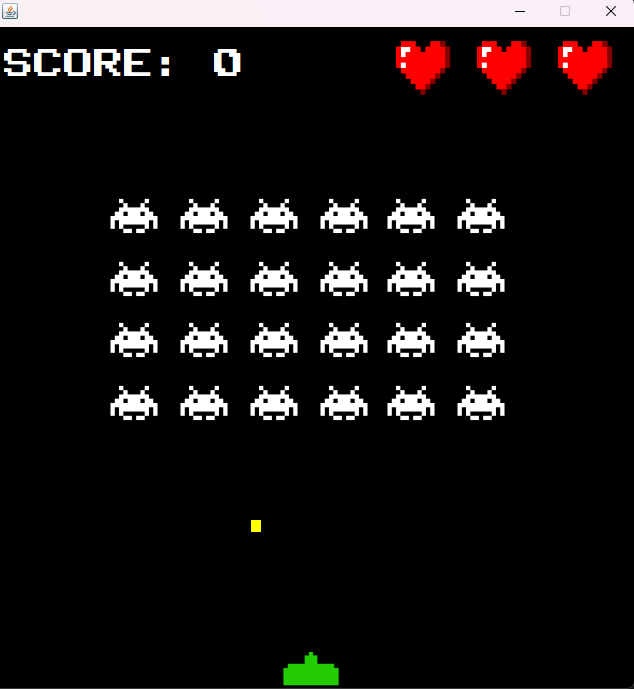

# JSpaceInvaders

JSpaceInvaders is a Java-based implementation of the classic Space Invaders game. This project is designed to provide a fun and engaging gaming experience while also serving as a learning tool for those interested in Java programming and game development.



# Features 

- Classic Space Invaders gameplay
- User-friendly interface
- Score Tracking


# Requirements

- Java Development Kit (JDK) 8 or higher

# Installation
1. Clone the repository to your local machine : 
``` bash
    git clone https://github.com/username/JSpaceInvaders.git
```
2. Open the project in your favorite Java IDE (e.g., IntelliJ IDEA, Eclipse, NetBeans).

3. Build and run the project using your IDE's built-in tools.

Or, if you prefer, you can use the pre-built JAR file included in the repository:

1. Download the JAR file from the repository: [JSpaceInvaders.jar](https://github.com/profumato4/JSpaceInvaders/blob/master/SpaceInvaders.jar)

2. Run the JAR file using the following command:
``` bash
    java -jar JSpaceInvaders.jar
```

# Usage 

1. Lauch the game by following the installation steps

2. Use the arrow keys to move your spaceship left and right, and press the spacebar to fire at the invading aliens.

3. Achieve the highest score possible by destroying as many aliens as you can while avoiding their projectiles.

# License
This software is licensed under the MIT license. See the [LICENSE](https://github.com/profumato4/JSpaceInvaders/blob/master/LICENSE.md) for more information.


# Question or Issues?
If you have any questions or encounter any issues, please use the [issue](https://github.com/profumato4/JSpaceInvaders/issues) tracker in the repository to report them.